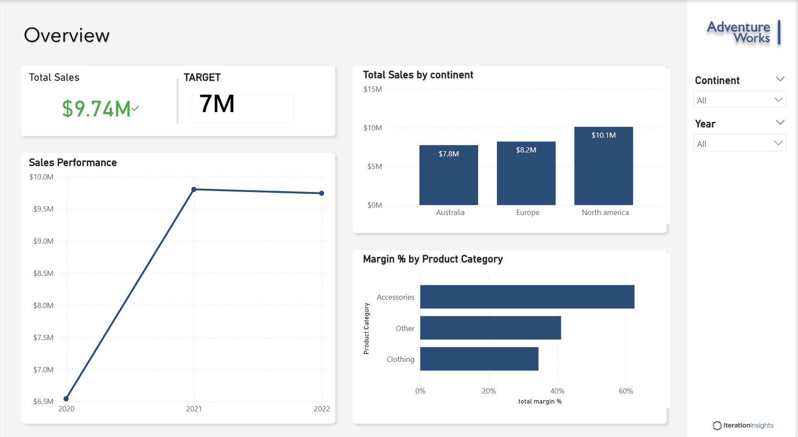
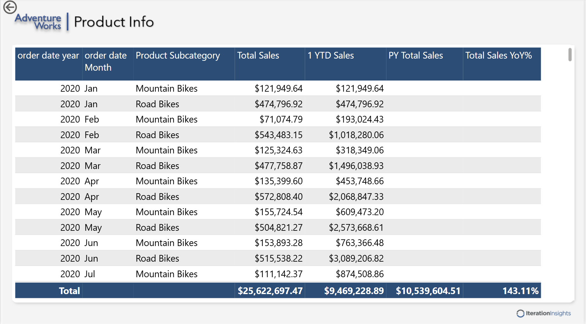

# Sales-Profitability-Dashboard
Interactive Sales Dashboard built using Power BI
# 📊 Sales Profitability Dashboard – Power BI

## 📌 Project Overview
This project presents an interactive Sales & Profitability Dashboard built using Power BI.  
It analyzes sales performance, profit margins, regional contribution, and product-level insights to support data-driven business decisions.

---
## 🎯 Business Objective
The objective of this dashboard is to:
- Monitor overall sales performance
- Identify high-profit product categories
- Analyze regional sales contribution
- Track trends over time

---

## 🛠 Tools & Technologies Used
- Power BI
- DAX (Calculated Measures & KPIs)
- Data Modeling (Fact & Dimension Tables)
- Power Query (Data Cleaning & Transformation)
- Excel (Data Source)

---

## 📈 Key KPIs Developed
- Total Sales
- Total Profit
- Profit Margin %
- Regional Sales Performance
- Product Category Contribution
- Time-based Sales Trend Analysis

---

## 🔎 Key Insights
- Identified top-performing regions by revenue.
- Analyzed product categories contributing highest profit margin.
- Detected sales growth trends over time.
- Evaluated profitability distribution across territories.

---

## 📷 Dashboard Preview

### Overview Page

### Product Sales Details

### Regional Sales Analysis

---

## 📂 Files Included
- `sales.pbix` – Power BI Dashboard File
- `Product.xlsx` – Product Data
- `Sales Territories.xlsx` – Territory Data
- 'CustomerList.txt'- Customer data
- 'Product Rollup.txt' - Product Rollup data
- Dashboard Screenshots

---

## 🚀 How to Use
1. Download the `.pbix` file.
2. Open in Power BI Desktop.
3. Explore interactive filters and visualizations.
